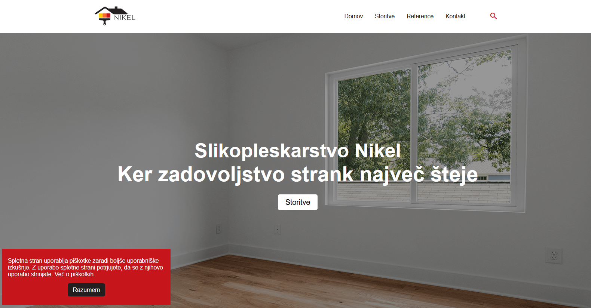
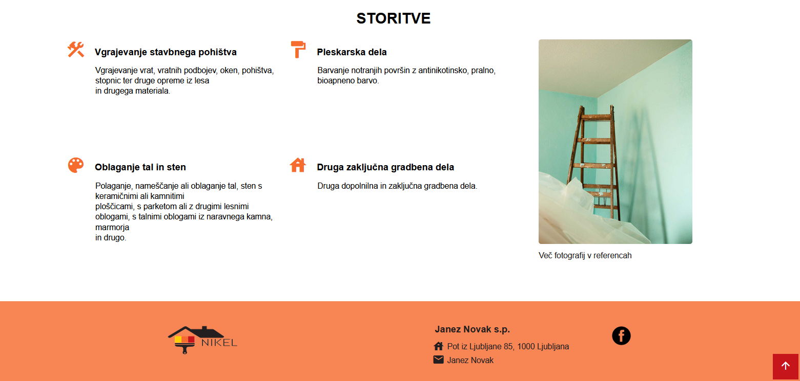
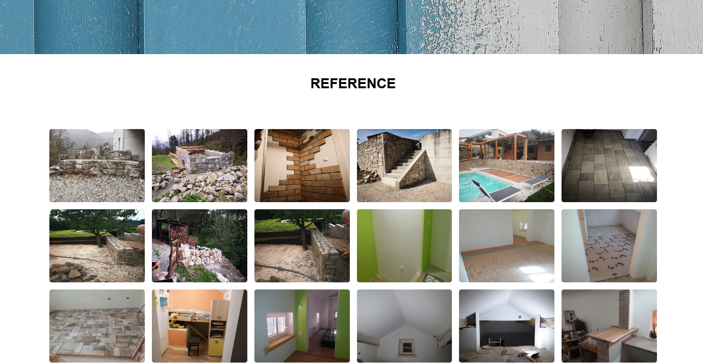
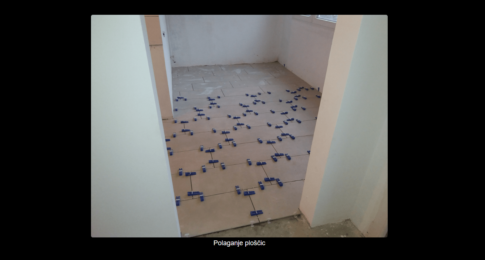

# Nikel Painting

I made WordPress website from scratch for an entrepreneur who was involved in painting.

## Browser Compatibility

All of the latest versions of <b>Chrome</b>, <b>Firefox</b>, <b>Edge</b> and <b>Opera</b> browsers are supported.

## Screenshots

Homepage with the Storitve button, which sends to the Services page.

Storitve page represents the services that the entrepreneur deals with.

Reference is a gallery of his work.

Image example with modal and image description. Click on the modal (black background) and the gallery will be appeared again.

Contact page with form and contact information.

[Back to the top](#nikel-painting)
